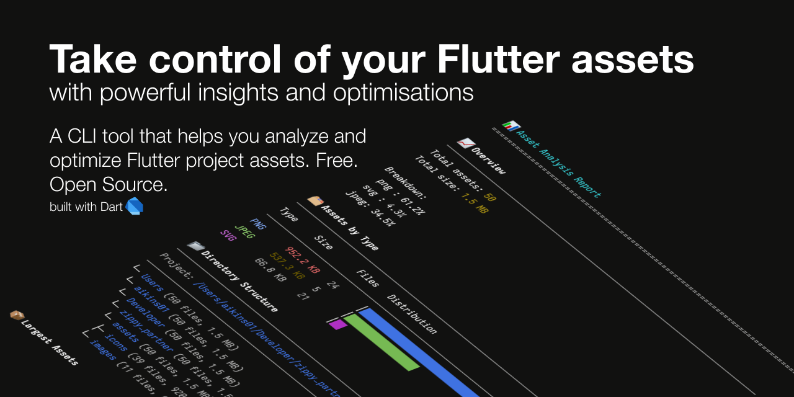

# asset_opt 🎯

A powerful Flutter/Dart tool for analyzing and optimizing project assets. Get detailed insights into your asset usage and automatically optimize images to improve your app's performance.



## Features 🚀

### Detailed Asset Analysis
- 📊 Size and type distribution visualization
- 📁 Directory structure breakdown
- 🔍 Image dimension analysis
- ⚠️ Issue detection and recommendations

### Smart Optimization
- 🗜️ Automatic image compression
- 📏 Size reduction while maintaining quality
- 🔄 Format conversion suggestions
- 💾 Safe backups before optimization

### Beautiful Reports
- 📈 Visual progress tracking
- 🎨 Color-coded terminal output
- 📋 Detailed JSON reports
- 📊 Size statistics and savings

## Installation 📥

```bash
dart pub global activate asset_opt
```

Or add to your `pubspec.yaml` for project-specific usage:

```yaml
dev_dependencies:
  asset_opt: ^0.1.0
```

## Usage 💻

### Command Line

```bash
# Show help and available commands
asset_opt --help

# Analyze project assets
asset_opt --analyze

# Analyze and optimize
asset_opt --optimize

# Specify project path and quality
asset_opt -p /path/to/project -q 85 --optimize

# Verbose output
asset_opt --verbose
```

### As a Library

```dart
import 'package:asset_opt/asset_opt.dart';

void main() async {
  // Initialize services
  final fileService = FileService();
  final imageService = ImageService();
  final analysisState = AnalysisState();

  // Create analyzer
  final analyzer = AnalyzeCommand(
    fileService,
    imageService,
    analysisState,
  );

  // Run analysis
  final analysis = await analyzer.execute('./');

  // Check for issues
  if (analysis.hasIssues()) {
    print('Found optimization opportunities:');
    for (final asset in analysis.assets) {
      if (asset.issues.isNotEmpty) {
        print('${asset.info.name}:');
        for (final issue in asset.issues) {
          print('  - ${issue.message}');
        }
      }
    }
  }
}
```

## Output Examples 📸

### Asset Analysis
```
📊 Asset Analysis Report
────────────────────────
Project: /Users/username/projects/my_app
────────────────────────
└─ assets (632 files, 22.4 MB)
   ├─ images (631 files, 22.4 MB)
   │  ├─ flags (492 files, 3.7 MB)
   │  └─ bgs (4 files, 2.5 MB)
   └─ icons (1 files, 829 B)
```

### Type Distribution
```
🗂  Assets by Type
────────────────────────
Type     Size       Files   Distribution
PNG      22.4 MB    631    │████████████████████████████  │ 65.2%
JPEG     10.2 MB    492    │████████████████              │ 29.8%
WEBP      1.5 MB      4    │███                           │  4.3%
SVG     829.0 B       1    │                              │  0.7%
```

### Optimization Suggestions
```
⚠️  Optimization Opportunities
────────────────────────
❌ background.png
   Current: 2.5 MB
   Recommended: < 500 KB (reduce by 80%)
   → Use pngquant or tinypng for lossless compression
```

## Configuration ⚙️

Create `asset_opt.yaml` in your project root:

```yaml
# Asset optimization settings
optimization:
  jpeg_quality: 85
  webp_quality: 80
  strip_metadata: true

# Size limits
limits:
  max_file_size: 1MB
  max_total_size: 50MB

# Patterns to exclude
exclude:
  - '**/test/assets/*'
```

## FAQ ❓

**Q: Is it safe to use on production assets?**
A: Yes! The tool creates backups before any optimization.

**Q: What image formats are supported?**
A: Currently supports PNG, JPEG, WebP, and SVG files.

**Q: Will this work with my CI/CD pipeline?**
A: Yes, the tool can be integrated into CI/CD workflows.

## Contributing 🤝

Contributions are welcome! Please read our [contributing guidelines](CONTRIBUTING.md) before submitting pull requests.

## Roadmap 🗺️

### Version 0.2.0
- [ ] Configuration file support
- [ ] Custom optimization presets
- [ ] Watch mode for development

### Version 0.3.0
- [ ] WebP conversion
- [ ] SVG optimization
- [ ] Asset usage analysis

## License 📄

Licensed under the [MIT License](LICENSE) file for details.

## Support 💪

If you find this tool helpful, please consider:
- Starring the repository ⭐
- Reporting issues 🐛
- Contributing to the code 💻
- Sharing with others 🌟

---
